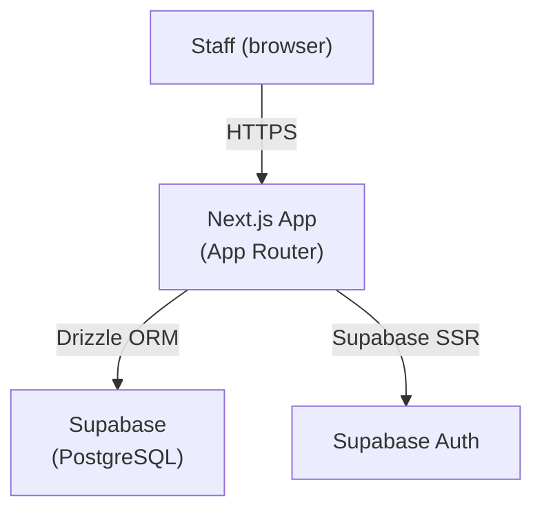

# Technical Specification — NeoVet CRM

| Field | Value |
|---|---|
| **Project** | NeoVet CRM |
| **Version** | 1.0 |
| **Author(s)** | Franco Zancocchia |
| **Status** | Active |
| **Last updated** | 2026-03-28 |
| **Related charter** | `crm/docs/charter.md` v1.0 |

---

## System Overview

### Description

Staff-only internal tool for managing clients (pet owners), patients (pets), clinical history, and appointments. Accessed via browser by Paula and the reception team. No public-facing endpoints in v1.

### Architecture Diagram

### Component Inventory

| Component | Technology | Purpose | Hosted at |
|---|---|---|---|
| Staff dashboard | Next.js App Router | UI for all CRM operations | Vercel |
| Database | Supabase PostgreSQL | Persistent data store | Supabase |
| Auth | Supabase SSR | Email login for staff | Supabase |
| File storage | Supabase Storage | Patient avatars (public) + clinical documents (private, signed URLs) | Supabase |

---

## Tech Stack

| Layer | Choice | Rationale |
|---|---|---|
| Framework | Next.js 14 App Router + TypeScript | Team's primary stack |
| UI components | Tailwind CSS + shadcn/ui | Consistent, accessible primitives |
| ORM | Drizzle ORM | Type-safe, migration-based |
| Database | Supabase (PostgreSQL) | Free tier, Auth included |
| Auth | Supabase SSR | Same provider as DB, built-in |
| Hosting | Vercel | Free tier sufficient for v1 |

---

## Data Model

### Entity Relationship Summary

A **Client** (owner) has many **Patients** (pets). A **Patient** has many **Appointments**, **Consultations**, **Vaccinations**, **DewormingRecords**, and **Documents**. A **Consultation** optionally links to one **Appointment** and has many **TreatmentItems**.

### Core Tables

#### `clients`

| Column | Type | Nullable | Description |
|---|---|---|---|
| `id` | text | No | Prefixed ID (`cli_`) |
| `name` | text | No | Owner full name |
| `phone` | text | No | WhatsApp-compatible phone number |
| `email` | text | Yes | Optional email |
| `imported_from_gvet` | boolean | No | True if migrated from Geovet export |
| `created_at` | timestamptz | No | |
| `updated_at` | timestamptz | No | |

#### `patients`

| Column | Type | Nullable | Description |
|---|---|---|---|
| `id` | text | No | Prefixed ID (`pat_`) |
| `client_id` | text | No | FK → clients |
| `name` | text | No | Pet name |
| `species` | text | No | e.g. "perro", "gato" |
| `breed` | text | Yes | e.g. "bulldog inglés" |
| `date_of_birth` | date | Yes | |
| `deceased` | boolean | No | Default false — shows "Fallecido" badge |
| `avatar_url` | text | Yes | Public URL from `patient-avatars` Storage bucket |
| `created_at` | timestamptz | No | |
| `updated_at` | timestamptz | No | |

#### `appointments`

| Column | Type | Nullable | Description |
|---|---|---|---|
| `id` | text | No | Prefixed ID (`apt_`) |
| `patient_id` | text | No | FK → patients |
| `scheduled_at` | timestamptz | No | |
| `duration_minutes` | integer | No | Default 30 |
| `reason` | text | Yes | |
| `status` | text | No | `pending` / `confirmed` / `cancelled` / `completed` |
| `staff_notes` | text | Yes | |
| `created_at` | timestamptz | No | |
| `updated_at` | timestamptz | No | |

#### `consultations`

| Column | Type | Nullable | Description |
|---|---|---|---|
| `id` | text | No | Prefixed ID (`con_`) |
| `patient_id` | text | No | FK → patients (cascade delete) |
| `appointment_id` | text | Yes | FK → appointments (set null on delete) |
| `subjective` | text | Yes | SOAP S — owner's report |
| `objective` | text | Yes | SOAP O — vet's observations |
| `assessment` | text | Yes | SOAP A — diagnosis |
| `plan` | text | Yes | SOAP P — next steps |
| `weight_kg` | numeric(5,2) | Yes | |
| `temperature` | numeric(4,1) | Yes | °C |
| `heart_rate` | numeric(5,0) | Yes | bpm |
| `respiratory_rate` | numeric(4,0) | Yes | rpm |
| `notes` | text | Yes | Free-text fallback (no SOAP structure required) |
| `created_at` | timestamptz | No | Set to historical visit date on import |
| `updated_at` | timestamptz | No | |

#### `treatment_items`

| Column | Type | Nullable | Description |
|---|---|---|---|
| `id` | text | No | Prefixed ID (`trt_`) |
| `consultation_id` | text | No | FK → consultations (cascade delete) |
| `description` | text | No | |
| `order` | integer | No | Display order within the consultation |
| `status` | enum | No | `pending` / `active` / `completed` |

#### `vaccinations`

| Column | Type | Nullable | Description |
|---|---|---|---|
| `id` | text | No | Prefixed ID (`vac_`) |
| `patient_id` | text | No | FK → patients (cascade delete) |
| `consultation_id` | text | Yes | FK → consultations (set null on delete) |
| `vaccine_name` | text | No | |
| `applied_at` | text | Yes | YYYY-MM-DD |
| `next_due_at` | text | Yes | YYYY-MM-DD |
| `batch_number` | text | Yes | |
| `notes` | text | Yes | |

#### `deworming_records`

| Column | Type | Nullable | Description |
|---|---|---|---|
| `id` | text | No | Prefixed ID (`dew_`) |
| `patient_id` | text | No | FK → patients (cascade delete) |
| `consultation_id` | text | Yes | FK → consultations (set null on delete) |
| `product` | text | No | Product name |
| `applied_at` | text | Yes | YYYY-MM-DD |
| `next_due_at` | text | Yes | YYYY-MM-DD |
| `dose` | text | Yes | |
| `notes` | text | Yes | |

#### `documents`

| Column | Type | Nullable | Description |
|---|---|---|---|
| `id` | text | No | Prefixed ID (`doc_`) |
| `patient_id` | text | No | FK → patients (cascade delete) |
| `file_name` | text | No | Original filename |
| `storage_path` | text | No | Path within `clinical-documents` Storage bucket |
| `mime_type` | text | No | |
| `size_bytes` | integer | No | |
| `created_at` | timestamptz | No | |

### Storage Buckets

| Bucket | Access | Max file size | Purpose |
|---|---|---|---|
| `patient-avatars` | Public read / auth write | 2 MB | Patient profile photos |
| `clinical-documents` | Auth only (signed URLs, 60s expiry) | 10 MB | Radiographs, lab results, etc. |

---

## Authentication & Authorization

| Area | Approach |
|---|---|
| User authentication | Supabase SSR email login |
| Session management | Supabase SSR cookies |
| Role model | All authenticated users have full access (v1 — staff only) |
| API route protection | Next.js middleware checks Supabase session |

---

## Environment Variables

| Variable | Required | Description |
|---|---|---|
| `NEXT_PUBLIC_SUPABASE_URL` | Yes | Supabase project URL |
| `NEXT_PUBLIC_SUPABASE_ANON_KEY` | Yes | Supabase anon public key |
| `SUPABASE_SERVICE_ROLE_KEY` | Yes | Supabase service role key (server only) |
| `DATABASE_URL` | Yes | PostgreSQL connection string (transaction mode, port 6543) |
| `NEXT_PUBLIC_APP_URL` | Yes | Public app URL |

---

## Deployment

| Environment | Branch | URL |
|---|---|---|
| Development | any | `http://localhost:3000` |
| Production | `main` | Vercel deployment URL |

### Database Migrations

- Managed by Drizzle ORM (`drizzle-kit`)
- Migration files committed to `crm/drizzle/migrations/`
- Run with `npm run db:migrate`
- Session mode connection string (port 5432) required for migrations

---

## Open Questions

| # | Question | Owner | Resolution |
|---|---|---|---|
| 1 | Geovet export format | Tomás / Paula | ✅ Resolved — CSV export analyzed and imported |
| 2 | Clinical history: structured vs free-text | Tomás / Paula | ✅ Resolved — SOAP implemented; all fields optional; free-text `notes` fallback |
| 3 | Soft-delete vs hard-delete | Franco | 🔲 Pending Paula meeting — currently hard-delete |
| 4 | AFIP billing from day 1 or deferred? | Paula | 🔲 Pending Paula meeting — blocks Phase D |
| 5 | Staff roles and access levels | Paula | 🔲 Pending Paula meeting — blocks Phase E |
