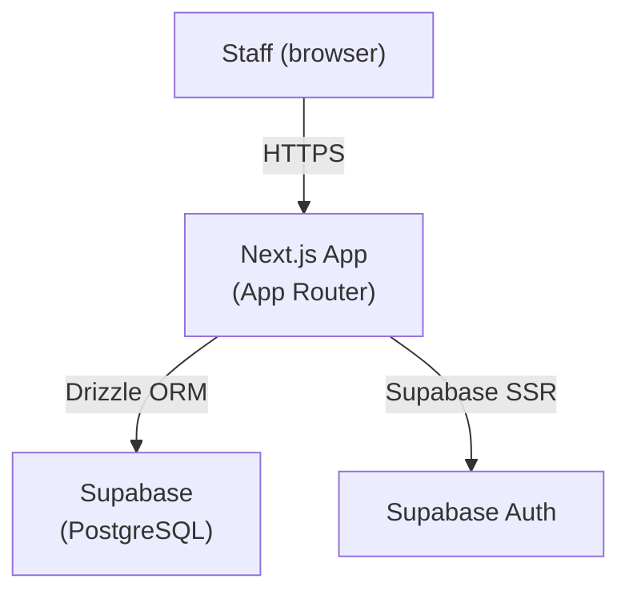

# Technical Specification — NeoVet CRM

| Field | Value |
|---|---|
| **Project** | NeoVet CRM |
| **Version** | 1.0 |
| **Author(s)** | Franco Zancocchia |
| **Status** | Draft |
| **Last updated** | 2026-03-26 |
| **Related charter** | `crm/docs/charter.md` v1.0 |

---

## System Overview

### Description

Staff-only internal tool for managing clients (pet owners), patients (pets), clinical history, and appointments. Accessed via browser by Paula and the reception team. No public-facing endpoints in v1.

### Architecture Diagram

### Component Inventory

| Component | Technology | Purpose | Hosted at |
|---|---|---|---|
| Staff dashboard | Next.js 14 App Router | UI for all CRM operations | Vercel |
| Database | Supabase PostgreSQL | Persistent data store | Supabase |
| Auth | Supabase SSR | Email login for staff | Supabase |

---

## Tech Stack

| Layer | Choice | Rationale |
|---|---|---|
| Framework | Next.js 14 App Router + TypeScript | Team's primary stack |
| UI components | Tailwind CSS + shadcn/ui | Consistent, accessible primitives |
| ORM | Drizzle ORM | Type-safe, migration-based |
| Database | Supabase (PostgreSQL) | Free tier, Auth included |
| Auth | Supabase SSR | Same provider as DB, built-in |
| Hosting | Vercel | Free tier sufficient for v1 |

---

## Data Model

### Entity Relationship Summary

A **Client** (owner) has many **Patients** (pets). A **Patient** has many **ClinicalHistory** entries and many **Appointments**.

### Core Tables

#### `clients`

| Column | Type | Nullable | Description |
|---|---|---|---|
| `id` | text | No | Prefixed ID (`cli_`) |
| `name` | text | No | Owner full name |
| `phone` | text | No | WhatsApp-compatible phone number |
| `email` | text | Yes | Optional email |
| `imported_from_gvet` | boolean | No | True if migrated from Geovet export |
| `created_at` | timestamptz | No | |
| `updated_at` | timestamptz | No | |

#### `patients`

| Column | Type | Nullable | Description |
|---|---|---|---|
| `id` | text | No | Prefixed ID (`pat_`) |
| `client_id` | text | No | FK → clients |
| `name` | text | No | Pet name |
| `species` | text | No | e.g. "perro", "gato" |
| `breed` | text | Yes | e.g. "bulldog inglés" |
| `date_of_birth` | date | Yes | |
| `created_at` | timestamptz | No | |
| `updated_at` | timestamptz | No | |

#### `appointments`

| Column | Type | Nullable | Description |
|---|---|---|---|
| `id` | text | No | Prefixed ID (`apt_`) |
| `patient_id` | text | No | FK → patients |
| `scheduled_at` | timestamptz | No | |
| `duration_minutes` | integer | No | Default 30 |
| `reason` | text | Yes | |
| `status` | text | No | `pending` / `confirmed` / `cancelled` / `completed` |
| `staff_notes` | text | Yes | |
| `created_at` | timestamptz | No | |
| `updated_at` | timestamptz | No | |

---

## Authentication & Authorization

| Area | Approach |
|---|---|
| User authentication | Supabase SSR email login |
| Session management | Supabase SSR cookies |
| Role model | All authenticated users have full access (v1 — staff only) |
| API route protection | Next.js middleware checks Supabase session |

---

## Environment Variables

| Variable | Required | Description |
|---|---|---|
| `NEXT_PUBLIC_SUPABASE_URL` | Yes | Supabase project URL |
| `NEXT_PUBLIC_SUPABASE_ANON_KEY` | Yes | Supabase anon public key |
| `SUPABASE_SERVICE_ROLE_KEY` | Yes | Supabase service role key (server only) |
| `DATABASE_URL` | Yes | PostgreSQL connection string (transaction mode, port 6543) |
| `NEXT_PUBLIC_APP_URL` | Yes | Public app URL |

---

## Deployment

| Environment | Branch | URL |
|---|---|---|
| Development | any | `http://localhost:3000` |
| Production | `main` | Vercel deployment URL |

### Database Migrations

- Managed by Drizzle ORM (`drizzle-kit`)
- Migration files committed to `crm/drizzle/migrations/`
- Run with `npm run db:migrate`
- Session mode connection string (port 5432) required for migrations

---

## Open Questions

| # | Question | Owner | Resolution |
|---|---|---|---|
| 1 | Geovet Excel export format — column names and structure | Tomás / Paula | <!-- TODO --> |
| 2 | Do we need clinical history as structured data or free-text notes? | Tomás / Paula | <!-- TODO --> |
| 3 | Should deleted records be soft-deleted or hard-deleted? | Franco | <!-- TODO --> |
