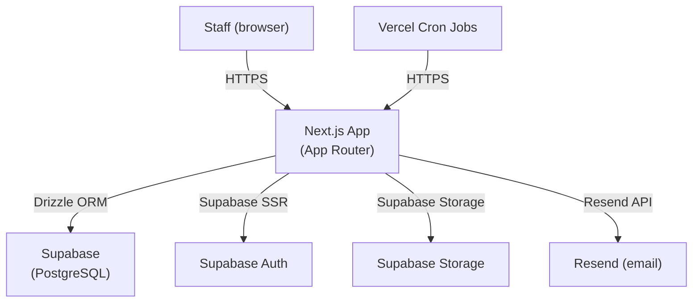

# Technical Specification — NeoVet CRM

| Field | Value |
|---|---|
| **Project** | NeoVet CRM |
| **Version** | 2.0 |
| **Author(s)** | Franco Zancocchia |
| **Status** | Active |
| **Last updated** | 2026-04-02 |
| **Related charter** | `crm/docs/v1/charter.md` v1.1 |

---

## System Overview

### Description

Staff-only internal tool for managing clients (pet owners), patients (pets), clinical history, appointments, grooming, pet shop, cash register, and billing. Accessed via browser (desktop and mobile) by Paula and the clinic team. No public-facing endpoints in v1.

### Architecture Diagram

### Component Inventory

| Component | Technology | Purpose | Hosted at |
|---|---|---|---|
| Staff dashboard | Next.js App Router | UI for all CRM operations | Vercel |
| Database | Supabase PostgreSQL | Persistent data store | Supabase |
| Auth | Supabase SSR | Email login for staff | Supabase |
| File storage | Supabase Storage | Patient avatars (public), clinical documents (private), grooming photos (private) | Supabase |
| Email delivery | Resend | Appointment, vaccine, and follow-up reminders | Resend |
| Cron scheduler | Vercel Cron Jobs | Triggers reminder emails on schedule | Vercel |

---

## Tech Stack

| Layer | Choice | Rationale |
|---|---|---|
| Framework | Next.js 16 App Router + TypeScript | Team's primary stack |
| UI components | Tailwind CSS + shadcn/ui | Consistent, accessible primitives |
| ORM | Drizzle ORM | Type-safe, migration-based |
| Database | Supabase (PostgreSQL) | Free tier, Auth included |
| Auth | Supabase SSR | Same provider as DB, built-in |
| Email | Resend + Vercel Cron | Transactional email for reminders |
| Hosting | Vercel | Free tier sufficient for v1 |

---

## Data Model

### Entity Relationship Summary

A **Client** (owner) has many **Patients** (pets). A **Patient** has many **Appointments**, **Consultations**, **Vaccinations**, **DewormingRecords**, **Documents**, and **GroomingSessions**. A **Consultation** optionally links to one **Appointment** and has many **TreatmentItems** and **ComplementaryMethods**. A **Consultation** can have **FollowUps** scheduled. **Appointments** reference a **Service** and can be assigned to a **Staff** member. **Staff** have roles (admin / vet / groomer). **Products** belong to the pet shop and are linked to **Providers** via **StockEntries** and sold via **Sales** → **SaleItems**. **CashSessions** track daily cash register operations with **CashMovements**.

### Core Tables

#### `clients`

| Column | Type | Nullable | Description |
|---|---|---|---|
| `id` | text | No | Prefixed ID (`cli_`) |
| `name` | text | No | Owner full name |
| `phone` | text | No | WhatsApp-compatible phone number |
| `email` | text | Yes | Optional email |
| `imported_from_gvet` | boolean | No | True if migrated from Geovet export |
| `created_at` | timestamptz | No | |
| `updated_at` | timestamptz | No | |

#### `patients`

| Column | Type | Nullable | Description |
|---|---|---|---|
| `id` | text | No | Prefixed ID (`pat_`) |
| `client_id` | text | No | FK → clients |
| `name` | text | No | Pet name |
| `species` | text | No | e.g. "perro", "gato" |
| `breed` | text | Yes | e.g. "bulldog inglés" |
| `date_of_birth` | date | Yes | |
| `deceased` | boolean | No | Default false — shows "Fallecido" badge |
| `avatar_url` | text | Yes | Public URL from `patient-avatars` Storage bucket |
| `created_at` | timestamptz | No | |
| `updated_at` | timestamptz | No | |

#### `staff`

| Column | Type | Nullable | Description |
|---|---|---|---|
| `id` | text | No | Prefixed ID (`stf_`) |
| `auth_id` | uuid | No | FK → Supabase Auth user |
| `name` | text | No | Display name |
| `email` | text | No | Login email |
| `role` | enum | No | `admin` / `vet` / `groomer` |
| `is_active` | boolean | No | Deactivated staff can't log in but data is preserved |
| `created_at` | timestamptz | No | |
| `updated_at` | timestamptz | No | |

#### `services`

| Column | Type | Nullable | Description |
|---|---|---|---|
| `id` | text | No | Prefixed ID (`svc_`) |
| `name` | text | No | Service name |
| `category` | enum | No | `cirugia` / `consulta` / `reproduccion` / `cardiologia` / `peluqueria` / `vacunacion` / `domicilio` / `petshop` / `otro` |
| `default_duration_minutes` | integer | No | Default duration when scheduling |
| `block_duration_minutes` | integer | Yes | Extra blocked time (e.g. surgeries) |
| `base_price` | numeric | Yes | Reference base price |
| `is_active` | boolean | No | Soft-delete — inactive services hidden from scheduling |

#### `appointments`

| Column | Type | Nullable | Description |
|---|---|---|---|
| `id` | text | No | Prefixed ID (`apt_`) |
| `patient_id` | text | No | FK → patients |
| `service_id` | text | Yes | FK → services |
| `assigned_staff_id` | text | Yes | FK → staff |
| `scheduled_at` | timestamptz | No | |
| `duration_minutes` | integer | No | Default 30, pre-loaded from service |
| `appointment_type` | enum | No | `veterinary` / `grooming` |
| `consultation_type` | enum | Yes | `clinica` / `virtual` / `domicilio` — only for veterinary appointments |
| `reason` | text | Yes | |
| `status` | text | No | `pending` / `confirmed` / `cancelled` / `completed` |
| `send_reminders` | boolean | No | Default true — controls whether reminder emails are sent |
| `staff_notes` | text | Yes | |
| `created_at` | timestamptz | No | |
| `updated_at` | timestamptz | No | |

#### `consultations`

| Column | Type | Nullable | Description |
|---|---|---|---|
| `id` | text | No | Prefixed ID (`con_`) |
| `patient_id` | text | No | FK → patients (cascade delete) |
| `appointment_id` | text | Yes | FK → appointments (set null on delete) |
| `subjective` | text | Yes | SOAP S — owner's report |
| `objective` | text | Yes | SOAP O — vet's observations |
| `assessment` | text | Yes | SOAP A — diagnosis |
| `plan` | text | Yes | SOAP P — next steps |
| `weight_kg` | numeric(5,2) | Yes | |
| `temperature` | numeric(4,1) | Yes | °C |
| `heart_rate` | numeric(5,0) | Yes | bpm |
| `respiratory_rate` | numeric(4,0) | Yes | rpm |
| `notes` | text | Yes | Free-text fallback (no SOAP structure required) |
| `created_at` | timestamptz | No | Set to historical visit date on import |
| `updated_at` | timestamptz | No | |

#### `treatment_items`

| Column | Type | Nullable | Description |
|---|---|---|---|
| `id` | text | No | Prefixed ID (`trt_`) |
| `consultation_id` | text | No | FK → consultations (cascade delete) |
| `description` | text | No | |
| `order` | integer | No | Display order within the consultation |
| `status` | enum | No | `pending` / `active` / `completed` |
| `medication` | text | Yes | Medication name |
| `dose` | text | Yes | e.g. "5mg/kg" |
| `frequency` | text | Yes | e.g. "cada 12hs" |
| `duration_days` | integer | Yes | Duration in days |

#### `complementary_methods`

| Column | Type | Nullable | Description |
|---|---|---|---|
| `id` | text | No | Prefixed ID |
| `consultation_id` | text | No | FK → consultations (cascade delete) |
| `study_type` | text | No | Type of study (ecografía, análisis de sangre, etc.) |
| `report` | text | Yes | Written report/findings |
| `photo_path` | text | Yes | Optional photo in Supabase Storage |
| `created_at` | timestamptz | No | |

#### `vaccinations`

| Column | Type | Nullable | Description |
|---|---|---|---|
| `id` | text | No | Prefixed ID (`vac_`) |
| `patient_id` | text | No | FK → patients (cascade delete) |
| `consultation_id` | text | Yes | FK → consultations (set null on delete) |
| `vaccine_name` | text | No | |
| `applied_at` | text | Yes | YYYY-MM-DD |
| `next_due_at` | text | Yes | YYYY-MM-DD |
| `batch_number` | text | Yes | |
| `notes` | text | Yes | |

#### `deworming_records`

| Column | Type | Nullable | Description |
|---|---|---|---|
| `id` | text | No | Prefixed ID (`dew_`) |
| `patient_id` | text | No | FK → patients (cascade delete) |
| `consultation_id` | text | Yes | FK → consultations (set null on delete) |
| `product` | text | No | Product name |
| `applied_at` | text | Yes | YYYY-MM-DD |
| `next_due_at` | text | Yes | YYYY-MM-DD |
| `dose` | text | Yes | |
| `notes` | text | Yes | |

#### `documents`

| Column | Type | Nullable | Description |
|---|---|---|---|
| `id` | text | No | Prefixed ID (`doc_`) |
| `patient_id` | text | No | FK → patients (cascade delete) |
| `file_name` | text | No | Original filename |
| `storage_path` | text | No | Path within `clinical-documents` Storage bucket |
| `mime_type` | text | No | |
| `size_bytes` | integer | No | |
| `category` | enum | Yes | `laboratorio` / `radiografia` / `ecografia` / `foto` / `otro` |
| `created_at` | timestamptz | No | |

#### `grooming_profiles`

| Column | Type | Nullable | Description |
|---|---|---|---|
| `id` | text | No | Prefixed ID |
| `patient_id` | text | No | FK → patients (unique) |
| `behavior_score` | integer | Yes | 1–10 general behavior score |
| `coat_type` | text | Yes | Coat type description |
| `coat_difficulties` | text | Yes | Knots, double coat, etc. |
| `behavior_notes` | text | Yes | e.g. "muerde", "necesita bozal" |
| `estimated_minutes` | integer | Yes | Manual time estimate (automatic in v3) |

#### `grooming_sessions`

| Column | Type | Nullable | Description |
|---|---|---|---|
| `id` | text | No | Prefixed ID |
| `patient_id` | text | No | FK → patients (cascade delete) |
| `appointment_id` | text | Yes | FK → appointments (set null on delete) |
| `groomed_by_id` | text | No | FK → staff |
| `price_tier` | enum | No | `min` / `mid` / `hard` |
| `final_price` | numeric | No | May differ from tier base price |
| `before_photo_path` | text | Yes | Supabase Storage path |
| `after_photo_path` | text | Yes | Supabase Storage path |
| `findings` | text[] | Yes | Checkboxes: pulgas, garrapatas, tumores, otitis, dermatitis |
| `notes` | text | Yes | |
| `created_by_id` | text | No | FK → staff (audit) |
| `created_at` | timestamptz | No | |

#### `settings`

| Column | Type | Nullable | Description |
|---|---|---|---|
| `key` | text | No | PK — setting name |
| `value` | text | No | Setting value |

Keys: `grooming_price_min`, `grooming_price_mid`, `grooming_price_hard`.

#### `schedule_blocks`

| Column | Type | Nullable | Description |
|---|---|---|---|
| `id` | text | No | Prefixed ID |
| `staff_id` | text | No | FK → staff |
| `start_date` | date | No | Block start |
| `end_date` | date | No | Block end |
| `start_time` | time | Yes | If null → full-day block |
| `end_time` | time | Yes | If null → full-day block |
| `reason` | text | Yes | |
| `created_at` | timestamptz | No | |

#### `email_logs`

| Column | Type | Nullable | Description |
|---|---|---|---|
| `id` | text | No | Prefixed ID |
| `type` | text | No | Reminder type (appointment_48h, appointment_24h, vaccine, follow_up) |
| `reference_id` | text | No | ID of the appointment/vaccination/follow-up |
| `sent_at` | timestamptz | No | |

Used for idempotency — prevents duplicate reminder emails.

#### `follow_ups`

| Column | Type | Nullable | Description |
|---|---|---|---|
| `id` | text | No | Prefixed ID |
| `patient_id` | text | No | FK → patients |
| `consultation_id` | text | Yes | FK → consultations |
| `scheduled_date` | date | No | Date to send follow-up email |
| `reason` | text | Yes | |
| `sent_at` | timestamptz | Yes | Null until sent |

### Pet Shop Tables

#### `products`

| Column | Type | Nullable | Description |
|---|---|---|---|
| `id` | text | No | Prefixed ID (`prd_`) |
| `name` | text | No | Product name |
| `category` | enum | No | `medicamento` / `vacuna` / `insumo_clinico` / `higiene` / `accesorio` / `juguete` / `alimento` / `transporte` / `otro` |
| `current_stock` | numeric | No | Auto-updated on stock entries and sales |
| `min_stock` | numeric | No | Low-stock threshold (default 0) |
| `cost_price` | numeric | Yes | Last known cost price (updated on stock entry) |
| `sell_price` | numeric | No | Sell price (before tax) |
| `tax_rate` | integer | No | IVA: `0` or `21` only in v1 |
| `is_active` | boolean | No | Soft-delete — can't delete if has sales |

#### `providers`

| Column | Type | Nullable | Description |
|---|---|---|---|
| `id` | text | No | Prefixed ID (`prv_`) |
| `name` | text | No | Provider name |
| `address` | text | Yes | |
| `phone` | text | Yes | |
| `email` | text | Yes | |
| `cuit` | text | Yes | Needed for Phase D (ARCA invoicing) |
| `notes` | text | Yes | Payment terms, contact preferences, etc. |
| `is_active` | boolean | No | Soft-delete |

#### `stock_entries`

| Column | Type | Nullable | Description |
|---|---|---|---|
| `id` | text | No | Prefixed ID (`ste_`) |
| `product_id` | text | No | FK → products (cascade) |
| `provider_id` | text | Yes | FK → providers (set null) |
| `quantity` | numeric | No | Units received |
| `cost_price` | numeric | Yes | Cost at time of entry |
| `notes` | text | Yes | |
| `created_by_id` | text | No | FK → staff (audit) |
| `created_at` | timestamptz | No | |

#### `sales`

| Column | Type | Nullable | Description |
|---|---|---|---|
| `id` | text | No | Prefixed ID (`sal_`) |
| `patient_id` | text | Yes | FK → patients (set null) — optional traceability |
| `sold_by_id` | text | No | FK → staff — who made the sale |
| `created_by_id` | text | No | FK → staff (audit) |
| `payment_method` | text | No | `efectivo` / `transferencia` / `debito` / `credito` / `mercadopago` |
| `payment_id` | text | Yes | FK → payments — hook for Phase D (ARCA) |
| `notes` | text | Yes | |
| `created_at` | timestamptz | No | |

#### `sale_items`

| Column | Type | Nullable | Description |
|---|---|---|---|
| `id` | text | No | Prefixed ID (`sli_`) |
| `sale_id` | text | No | FK → sales (cascade) |
| `product_id` | text | No | FK → products (RESTRICT — can't delete product with sales) |
| `quantity` | numeric | No | |
| `unit_price` | numeric | No | Snapshot of price at time of sale |
| `tax_rate` | integer | No | Snapshot of IVA at time of sale |

### Cash Register Tables

#### `cash_sessions`

| Column | Type | Nullable | Description |
|---|---|---|---|
| `id` | text | No | Prefixed ID (`csh_`) |
| `name` | text | Yes | Optional label (for future multi-register) |
| `opened_by_id` | text | No | FK → staff |
| `opened_at` | timestamptz | No | |
| `closed_at` | timestamptz | Yes | Null while open |
| `opening_amount` | numeric | No | Starting cash |
| `closing_cash_counted` | numeric | Yes | Actual cash counted at close |
| `closing_notes` | text | Yes | |

Total = opening + sales in period + extra income − expenses. Sales sourced from `sales` table filtered by date range.

#### `cash_movements`

| Column | Type | Nullable | Description |
|---|---|---|---|
| `id` | text | No | Prefixed ID (`cmv_`) |
| `session_id` | text | No | FK → cash_sessions (cascade) |
| `type` | enum | No | `ingreso` / `egreso` |
| `amount` | numeric | No | |
| `payment_method` | text | No | |
| `description` | text | Yes | |
| `created_by_id` | text | No | FK → staff (audit) |
| `created_at` | timestamptz | No | |

### Storage Buckets

| Bucket | Access | Max file size | Purpose |
|---|---|---|---|
| `patient-avatars` | Public read / auth write | 2 MB | Patient profile photos |
| `clinical-documents` | Auth only (signed URLs, 60s expiry) | 10 MB | Radiographs, lab results, etc. |
| `grooming-photos` | Auth only (signed URLs) | 10 MB | Before/after grooming session photos |

---

## Authentication & Authorization

| Area | Approach |
|---|---|
| User authentication | Supabase SSR email login |
| Session management | Supabase SSR cookies |
| Role model | Three roles: `admin`, `vet`, `groomer` — enforced via middleware |
| API route protection | Next.js middleware checks Supabase session + role |

### Role Access Matrix

| Area | Admin | Vet | Groomer |
|---|---|---|---|
| Clients (CRUD) | ✅ Full | 👁️ Read only | ❌ |
| Patients (CRUD) | ✅ Full | ✅ Read + edit | ❌ |
| Appointments | ✅ Full | 👁️ Veterinary only | 👁️ Grooming only |
| Consultations (CRUD) | ✅ Full | ✅ Full | ❌ |
| Grooming sessions | ✅ Full | ❌ | ✅ Full |
| Grooming profiles | ✅ Edit | ❌ | ✅ Edit |
| Pet shop (all) | ✅ Full | ❌ | ❌ |
| Cash register | ✅ Full | ❌ | ❌ |
| Billing | ✅ Full | ❌ | ❌ |
| Staff management | ✅ Full | ❌ | ❌ |
| Settings | ✅ Full | ❌ | ❌ |

---

## Environment Variables

| Variable | Required | Description |
|---|---|---|
| `NEXT_PUBLIC_SUPABASE_URL` | Yes | Supabase project URL |
| `NEXT_PUBLIC_SUPABASE_ANON_KEY` | Yes | Supabase anon public key |
| `SUPABASE_SERVICE_ROLE_KEY` | Yes | Supabase service role key (server only) |
| `DATABASE_URL` | Yes | PostgreSQL connection string (transaction mode, port 6543) |
| `NEXT_PUBLIC_APP_URL` | Yes | Public app URL |
| `RESEND_API_KEY` | Yes | Resend API key for email delivery |
| `EMAIL_FROM` | Yes | Sender email address (verified domain in Resend) |
| `CLINIC_ADDRESS` | Yes | Clinic address shown in email templates |
| `CRON_SECRET` | Yes | Secret token to authenticate Vercel Cron requests |

Phase D will add ARCA-related variables (certificate, CUIT, endpoint, punto de venta).

---

## Deployment

| Environment | Branch | DB | URL |
|---|---|---|---|
| Development | any | Preview DB (Supabase Branch) | `http://localhost:3000` |
| Preview | `dev` | Preview DB (Supabase Branch) | Vercel preview URL |
| Production | `main` | Production DB | Vercel deployment URL |

Pushing to `dev` triggers Supabase to run pending migrations on the preview database. Merging `dev` → `main` triggers migrations on the production database.

### Database Migrations

- Managed by Drizzle ORM (`drizzle-kit`)
- Schema changes written in `src/db/schema/`
- Migration files generated with `npm run db:generate` into `supabase/migrations/`
- Applied with `npm run db:migrate`
- Session mode connection string (port 5432) required for migrations

### Cron Jobs

| Schedule | Endpoint | Purpose |
|---|---|---|
| `0 12 * * *` | `/api/cron/appointment-reminders` | Send 48h and 24h appointment reminders |
| `0 12 * * *` | `/api/cron/vaccine-reminders` | Send 7-day vaccine due reminders |
| `0 12 * * *` | `/api/cron/follow-up-reminders` | Send scheduled post-consultation follow-ups |

All cron endpoints are excluded from auth middleware via `proxy.ts`. Authenticated by `CRON_SECRET` header.

---

## Open Questions

| # | Question | Owner | Resolution |
|---|---|---|---|
| 1 | Geovet export format | Tomás / Paula | ✅ Resolved — CSV export analyzed and imported |
| 2 | Clinical history: structured vs free-text | Tomás / Paula | ✅ Resolved — SOAP implemented; all fields optional; free-text `notes` fallback |
| 3 | Soft-delete vs hard-delete | Franco | 🔲 Pending — currently hard-delete for most entities, soft-delete for staff/products/providers/services |
| 4 | ARCA billing integration details | Paula | 🔲 Pending — Paula to provide certificate, CUIT, endpoint, punto de venta. Blocks Phase D.3 |
| 5 | Staff roles and access levels | Paula | ✅ Resolved — admin / vet / groomer implemented |
| 6 | Grooming base prices per tier | Paula | 🔲 Pending — configurable in settings, no default values seeded yet |
| 7 | Email sender address (Resend domain) | Tomás | 🔲 Pending — domain verification needed |
