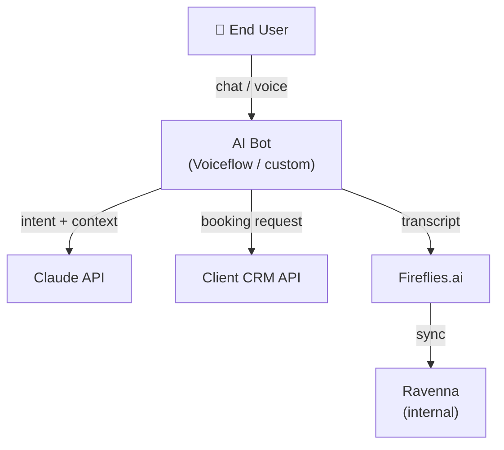

# Technical Specification
<!--
  INSTRUCTIONS FOR USE
  ────────────────────
  Fill this document during the Design phase, after the project charter is approved.
  It is the authoritative technical reference for the project.
  Update it as the project evolves — do not let it go stale.

  A technical spec that doesn't reflect reality is worse than no spec.

  Store this file at: docs/technical-spec.md in the project repository.
-->

---

## 1. Document Info

| Field | Value |
|---|---|
| **Project** | |
| **Version** | 1.0 |
| **Author(s)** | |
| **Status** | <!-- Draft / In Review / Approved / Superseded --> |
| **Last updated** | <!-- YYYY-MM-DD --> |
| **Related charter** | `docs/charter.md` v<!-- X.X --> |

---

## 2. System Overview

<!--
  Describe the system in 3–5 sentences: what it does, who uses it,
  and the main technical components. Include a high-level diagram
  if the system has more than 2–3 components.
-->

### 2.1 Description

### 2.2 Architecture Diagram

<!--
  Embed or link a diagram. Mermaid is preferred for maintainability.
  Example:
-->

### 2.3 Component Inventory

| Component | Technology | Purpose | Hosted at |
|---|---|---|---|
| | | | |
| | | | |

---

## 3. Tech Stack

| Layer | Choice | Rationale |
|---|---|---|
| Frontend | | |
| Backend / API | | |
| Database | | |
| Background tasks | | |
| AI / LLM | | |
| Auth | | |
| Hosting | | |
| Monitoring / Errors | | |
| CI/CD | | |

---

## 4. Data Model

<!--
  Describe the core entities and their relationships.
  For each table, list columns, types, constraints, and purpose.
  If using Drizzle or Prisma, reference the schema file directly.
-->

### 4.1 Entity Relationship Summary

<!--
  A brief description of the main entities and how they relate.
  Example: "A Company has many Meetings. A Meeting has one Extraction.
  A Project belongs to one Company and has many Payments."
-->

### 4.2 Core Tables

<!-- Repeat this block for each significant table -->

#### `table_name`

| Column | Type | Nullable | Default | Description |
|---|---|---|---|---|
| `id` | text | No | — | Prefixed ID (e.g., `xx_`) |
| `created_at` | timestamptz | No | `now()` | Row creation time |
| `updated_at` | timestamptz | No | `now()` | Last modification time |
| `deleted_at` | timestamptz | Yes | null | Soft delete timestamp |

**Relationships:**
-

**Constraints:**
-

**Notes:**
<!--  Any business rules that govern this table. -->

---

## 5. API & Integration Contracts

<!--
  For each external API or integration, document:
  - What it does in the context of this project
  - Authentication method
  - Key endpoints used
  - Known limitations or quotas
  - What happens when it is unavailable
-->

### 5.X — [Integration Name]

| Field | Value |
|---|---|
| **Service** | |
| **Auth method** | <!-- API key / OAuth2 / Webhook secret --> |
| **Env var** | <!-- e.g., VOICEFLOW_API_KEY --> |
| **Sandbox available** | <!-- Yes / No --> |
| **Rate limits** | |
| **Fallback behavior** | <!-- What the system does when this API is down --> |

**Endpoints used:**

| Method | Path | Purpose |
|---|---|---|
| GET | | |
| POST | | |

**Payload examples:**
<!-- Include at least one example request and response for each endpoint. -->

---

## 6. Background Tasks

<!--
  For each async/scheduled task, document its trigger, inputs, outputs,
  idempotency strategy, and failure behavior.
-->

### 6.X — `task-id`

| Field | Value |
|---|---|
| **Trigger** | <!-- On event / Scheduled (cron) / Manual --> |
| **Schedule** | <!-- e.g., every 15 min / first of month / n/a --> |
| **Input payload** | <!-- e.g., { meetingId: string } --> |
| **Idempotency** | <!-- Describe how duplicate runs are handled --> |
| **Max duration** | |
| **On success** | <!-- What state/rows are updated --> |
| **On failure** | <!-- How failure is surfaced to the user --> |
| **Retry policy** | <!-- e.g., 2 automatic retries, then terminal failed state --> |

---

## 7. Authentication & Authorization

| Area | Approach |
|---|---|
| User authentication | |
| Session management | |
| Role model | <!-- e.g., All users have full access / roles: admin, viewer --> |
| API route protection | |
| Sensitive data at rest | |

**Users who have access to this system:**
<!-- List user types and what they can do -->

---

## 8. AI / LLM Usage

<!--
  For each place the system calls an LLM, document the prompt strategy,
  model choice, token budget, and output validation approach.
-->

### 8.X — [Feature name]

| Field | Value |
|---|---|
| **Model** | <!-- e.g., claude-sonnet-4-6 --> |
| **Calling pattern** | <!-- tool_use / plain text / streaming --> |
| **Prompt location** | <!-- File path --> |
| **Output validation** | <!-- Zod schema / regex / none --> |
| **Estimated tokens per call** | <!-- input: X / output: Y --> |
| **Monthly cost estimate** | <!-- At expected volume --> |
| **Fallback on LLM error** | |

---

## 9. Error Handling Strategy

| Category | Strategy |
|---|---|
| LLM API error | Retry N times → mark task as `failed` → surface to user |
| External API 4xx | Log warning, return user-friendly error, do not retry |
| External API 5xx / timeout | Retry with exponential backoff up to N times |
| DB write failure | Use transactions for multi-step writes; surface error, do not silently fail |
| Background task failure | Task reaches terminal `failed` state; user sees actionable error in UI |
| Unhandled exception | Captured by Sentry with full context |

---

## 10. Environment Variables

<!--
  Every env var used by the project. Never include actual values here.
  Values live in .env (local) and the hosting platform (production).
-->

| Variable | Required | Description | Example |
|---|---|---|---|
| `DATABASE_URL` | Yes | PostgreSQL connection string | `postgresql://...` |
| `NEXTAUTH_SECRET` | Yes | NextAuth JWT signing secret | (random 32-char string) |
| | | | |

---

## 11. Deployment

### 11.1 Environments

| Environment | URL | Branch | Purpose |
|---|---|---|---|
| Development | localhost | any | Local development |
| Staging | | `develop` / `staging` | Pre-production validation |
| Production | | `main` | Live |

### 11.2 Deployment Process

<!--
  Step-by-step. Automate anything that can be automated and document what can't.
-->

1.
2.
3.

### 11.3 Database Migrations

- Migrations are managed by <!-- Drizzle / Prisma / Flyway -->.
- Migration files are committed to the repository at `<!-- path -->`.
- Migrations are applied to production via `<!-- command or CI step -->`.
- **No migration is applied to production without first running on staging.**
- Rollback procedure: <!-- describe -->

---

## 12. Monitoring & Alerting

| What | Tool | Alert threshold | Who is notified |
|---|---|---|---|
| Runtime errors | Sentry | Any new error | |
| Background task failures | <!-- Trigger.dev / custom --> | Any failed task | |
| Uptime | <!-- e.g., Better Uptime --> | Downtime > 2 min | |
| DB connection pool | <!-- logs / APM --> | | |

---

## 13. Open Questions

<!--
  Technical questions that are not yet resolved.
  Every item here should have an owner and a deadline.
  Remove items as they are resolved (or convert to ADRs if they require a decision).
-->

| # | Question | Owner | Deadline | Resolution |
|---|---|---|---|---|
| 1 | | | | |

---

## 14. Revision History

| Version | Date | Author | Changes |
|---|---|---|---|
| 1.0 | | | Initial version |
